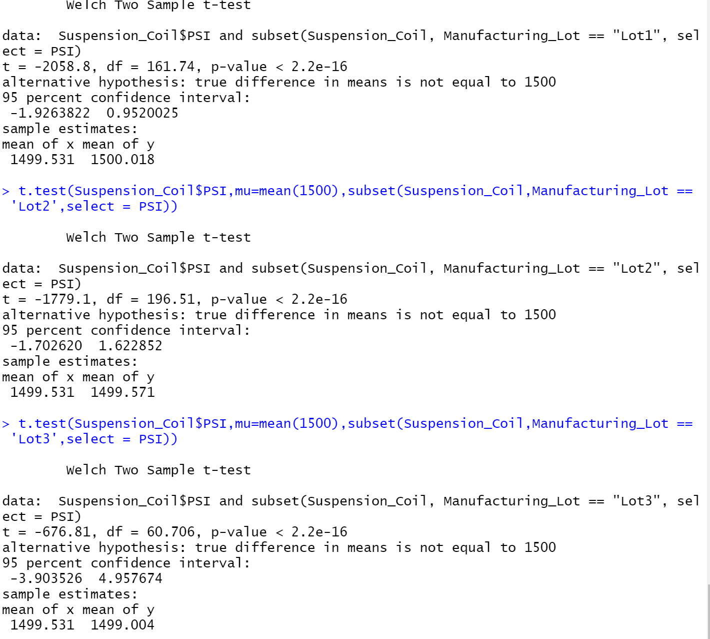

# MechaCar Statistical Analysis

## Linear Regression for MPG Perdiction

1) Which variables/coefficients provided a non-random amount of variance to the mpg values in the dataset?
- These variables based upon their Pr(>|t|) score are unlikely to provide any non-random variance: the Intercept, Vehicle Length and Ground Clearance. The Intercept as a high level of statistical significance, it means there are other variables and factors that contribute to the discrepancy in mpg.

2) Is the slope of the linear model considered to be zero? Why or why not?
- The Slope is not considered to be zero, but if there is no significant linear relationship, each dependent value would be determined by random chance and errors. As seen in the question above and the data there is a sigificant linear relationship,so based on that relationship the Slope is not considered zero.

3) Does this linear model predict mpg of MechaCar prototypes e ffectively? Why or why not?
- The R-Squared value of 0.7149, which indicates that it is an effective model to predict mpg, and it might be guilty of overfitting given the lack of significant variables (Only Vehicle Length and Ground Clearance).

## Summary Statistics on Suspension Coil

In total the variance of the suspension coils meets the design specifications as seen in the Total Summary data.

However, in the Lot Summary data we see that both Lots 1 and 2 have very low variance, while within the design specifications, but Lot 3, with a variance of over 220 falls why outside the requirement.

## T-Tests on Suspension Coils

Overall our Suspension Coil T-test is statistically signicant and we would not reject the Null Hypothesis.
Within each lot, the p-value is less than 0.05, and we would reject our Null Hypothesis.

## Study Design: Mechacar vs. Competition
1) How does the MechaCars perform vs. the competion on: City/Hwy MPG; horsepower and safety; all versus price? 
- We want to determine whether the MechaCar performs better on these metrics vs. the cost of the car vs. its competition. The Metrics that will be measured are: Price, MPG-City, MPG-huighway and Horsepower.
- Null hypothesis: There is no significant difference between the Competition and the MechaCar.
2) Alternative Hypothesis: 
- There is a significant differecne between the Competition and the MechaCar.
- I will need the following metrics for each competitor and the MechaCar: Price, HorsePower, MPG-City, MPG-Highway. 
I will run the following tests: 
- Chi Square Test (To deterimine frequency between groups).\
- Two Sample T-Tests (To see if there is a difference between the sample groups)
- Anova sample for the two groups.
